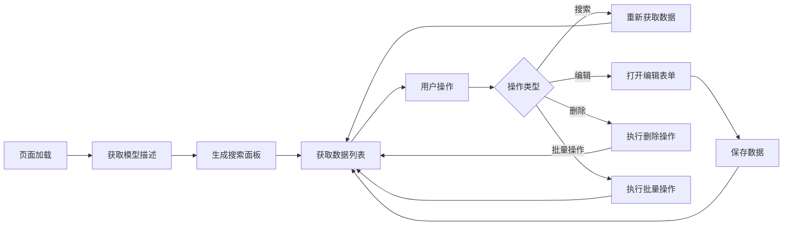

# 皇冠管理系统 - 使用指南

## 🎯 概述

皇冠管理系统是一个基于 ModelList 组件构建的完整模型管理解决方案，提供了全面的皇冠数据管理功能。

## 🚀 快速开始

### 1. 启动开发服务器

```bash
npm start
# 或
yarn start
# 或
pnpm start
```

### 2. 访问皇冠管理页面

- URL: `http://localhost:8000/crown`
- 菜单路径: 左侧菜单 → "皇冠管理"

### 3. 登录账户

使用以下测试账户登录：
- **用户名**: `admin`
- **密码**: `ant.design`

## 📋 功能特性

### ✅ 已实现功能

1. **数据展示**
   - 分页列表展示皇冠数据
   - 多字段排序支持
   - 响应式表格设计

2. **搜索功能**
   - 按名称、类型、拥有者搜索
   - 按状态、材质、地区筛选
   - 实时搜索结果更新

3. **CRUD 操作**
   - 新增皇冠记录
   - 编辑现有记录
   - 删除单个或批量记录
   - 表单验证和错误处理

4. **批量操作**
   - 批量激活/停用
   - 批量设置维护状态
   - 数据导出功能

## 🎨 数据模型

### 皇冠字段说明

| 字段        | 类型     | 说明       | 示例                         |
| ----------- | -------- | ---------- | ---------------------------- |
| id          | 整数     | 唯一标识符 | 1                            |
| name        | 字符串   | 皇冠名称   | "黄金皇冠"                   |
| type        | 选择     | 皇冠类型   | gold, diamond, jade...       |
| level       | 整数     | 等级(1-7)  | 5                            |
| price       | 浮点数   | 价格       | 9999.99                      |
| weight      | 浮点数   | 重量(kg)   | 2.5                          |
| material    | 选择     | 主要材质   | gold, silver, platinum...    |
| owner       | 字符串   | 拥有者     | "King Arthur"                |
| region      | 选择     | 地区来源   | Europe, Asia, Fantasy...     |
| status      | 选择     | 当前状态   | available, reserved, sold... |
| is_active   | 布尔     | 激活状态   | true/false                   |
| description | 文本     | 详细描述   | "传说级黄金皇冠..."          |
| created_at  | 日期时间 | 创建时间   | 自动生成                     |
| updated_at  | 日期时间 | 更新时间   | 自动更新                     |

## 🔧 技术实现

### 核心组件

- **ModelList**: 通用模型管理组件
- **CrownManagement**: 皇冠管理页面
- **Mock API**: 完整的后端 API 模拟

### API 端点

- `POST /api/admin/model-desc` - 获取模型描述
- `POST /api/admin/model-data` - 获取分页数据
- `POST /api/admin/model-action` - 执行批量操作
- `POST /api/admin/model-delete` - 删除数据
- `POST /api/admin/model-save` - 保存数据

### 数据流程



## 📦 Mock 数据

系统包含 8 个预设的皇冠记录，涵盖不同类型：

1. **黄金皇冠** - 传说级，欧洲风格
2. **钻石皇冠** - 神话级，英国皇室
3. **翡翠皇冠** - 史诗级，东方古典
4. **水晶皇冠** - 稀有级，北极主题
5. **红宝石皇冠** - 传说级，中东风格
6. **蓝宝石皇冠** - 传说级，海洋主题
7. **彩虹皇冠** - 至尊级，幻想世界
8. **古董皇冠** - 史诗级，古代文明

## 🎯 使用场景

### 常见操作流程

1. **查看所有皇冠**
   - 访问皇冠管理页面
   - 浏览分页数据列表

2. **搜索特定皇冠**
   - 使用搜索面板输入条件
   - 点击"搜索"按钮查看结果

3. **添加新皇冠**
   - 点击"新增"按钮
   - 填写皇冠信息表单
   - 点击"创建"保存

4. **编辑皇冠信息**
   - 点击列表中的"编辑"按钮
   - 修改表单信息
   - 点击"保存"更新

5. **批量管理皇冠**
   - 选择多个皇冠记录
   - 使用批量操作按钮
   - 确认操作执行

## 🔍 故障排除

### 常见问题

1. **页面无法加载**
   - 检查开发服务器是否启动
   - 确认 URL 路径正确

2. **数据不显示**
   - 检查 mock 数据是否正确加载
   - 确认 API 端点响应正常

3. **搜索不工作**
   - 验证搜索条件格式
   - 检查网络请求状态

4. **表单验证错误**
   - 确认必填字段已填写
   - 检查数据格式是否正确

## 🚧 扩展开发

### 添加新字段

1. 更新 `mock/crown.ts` 中的模型描述
2. 修改 `pages/crown/index.tsx` 中的表单组件
3. 测试新字段的显示和编辑功能

### 自定义操作

1. 在模型描述中添加新的 action
2. 实现对应的 API 处理逻辑
3. 更新前端界面显示

### 集成真实 API

1. 替换 mock 数据为真实 API 调用
2. 更新 API 端点配置
3. 处理认证和错误逻辑

---

**🎉 恭喜！皇冠管理系统已成功集成到您的项目中，现在可以开始管理您的皇冠收藏了！**
